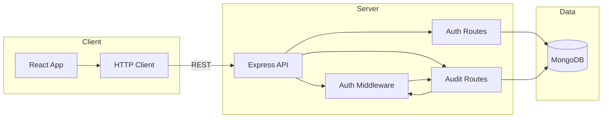
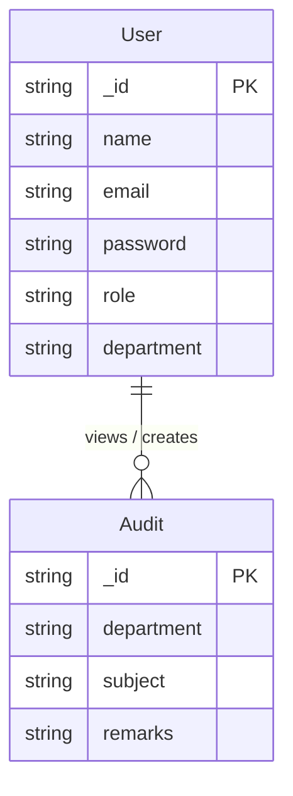

# Secure Academic Audit Management Tool

A full-stack web application for managing academic audits with role-based access (Admin, Staff, Student). Built with the **MERN** stack.

---

## Tech Stack

**MERN stack** — MongoDB · Express · React · Node.js

**Documentation:** [View SRS](https://docs.google.com/document/d/1ymDLTrmieVgAhO71OzmAkfq8Z1TxrwL_/edit?usp=sharing) (Software Requirements Specification)

---

## Project Structure

```
secure-audit-tool/
├── backend/          # Express API (port 4000)
│   ├── models/       # User, Audit
│   ├── routes/       # Auth, Audit
│   └── server.js
├── frontend/         # React app (port 3000)
│   └── src/
│       └── pages/    # Login, Register, Admin, Staff, Student
├── README.md
├── EVALUATION_RUBRICS.md
└── .gitignore
```

---

## Tech Stack & Justification

| Layer     | Technology        | Justification |
|-----------|-------------------|---------------|
| Frontend  | React 19          | Component-based UI, hooks for state and API calls. |
| Backend   | Node.js + Express 5 | REST APIs, middleware, non-blocking I/O. |
| Database  | MongoDB + Mongoose | Flexible schema; Mongoose for validation and modeling. |
| Auth      | JWT (jsonwebtoken) | Stateless auth; works with role-based access. |

---

## System Flow Diagram



**Flow:** Browser → React → axios → Express API → Mongoose → MongoDB. Export as image from [Mermaid Live](https://mermaid.live) if needed for submission.

---

## DB Schema & ER Diagram

**Entities:** User, Audit. Users (by role) create/view Audits; Audits have a department.



**Collections:** `users` (name, email, password, role, department) — see `backend/models/User.js`. `audits` (department, subject, remarks) — see `backend/models/Audit.js`.

---

## UI/UX Wireframes & Theme

**Color palette** (in `frontend/src/index.css`): Primary `#1e40af`, Background `#f8fafc`, Text `#0f172a`, Error `#dc2626`, Success `#16a34a`, Border `#e2e8f0`.

**Screens:** Login (email, password, link to Register) → after login redirect by role → **Student** (audits for department only) → **Staff/Admin** (all audits, add audit). **User journey:** Landing → Login/Register → Role dashboard → Logout.

Add Figma/XD link or wireframe images here if required for submission.

---

## Prerequisites

- Node.js (v18+), MongoDB, Git

---

## Installation & Setup

### 1. Clone

```bash
git clone <repository-url>
cd secure-audit-tool
```

### 2. Backend

```bash
cd backend
npm install
```

Copy `.env.example` to `.env` and set `JWT_SECRET`, `PORT`, `MONGO_URI`. Then:

```bash
npm run dev
```

API: **http://localhost:4000**

### 3. Frontend

```bash
cd frontend
npm install
npm start
```

App: **http://localhost:3000**

---

## Branching Strategy

**main** – production. **develop** – integration. **feature/&lt;name&gt;** – new features. **fix/&lt;name&gt;** – bug fixes.

---

## Phase 1 – GitHub setup

```bash
git init
git add .
git commit -m "Phase 1: boilerplate, MERN stack, wireframes & theme"
git branch -M main
git remote add origin https://github.com/YOUR_USERNAME/YOUR_REPO_NAME.git
git push -u origin main
```

---

## API Overview

| Method | Endpoint              | Description        |
|--------|------------------------|--------------------|
| POST   | `/auth/register`       | Register user      |
| POST   | `/auth/login`          | Login (returns JWT) |
| GET    | `/audit`               | List all audits    |
| GET    | `/audit/student/:dept`  | Audits by department |
| POST   | `/audit/add`           | Add audit          |

**Auth:** Send `Authorization: Bearer <token>` for protected routes. Test with Postman or Thunder Client.

---

## Evaluation Rubrics

See **EVALUATION_RUBRICS.md** for the Phase 1–3 checklist.
